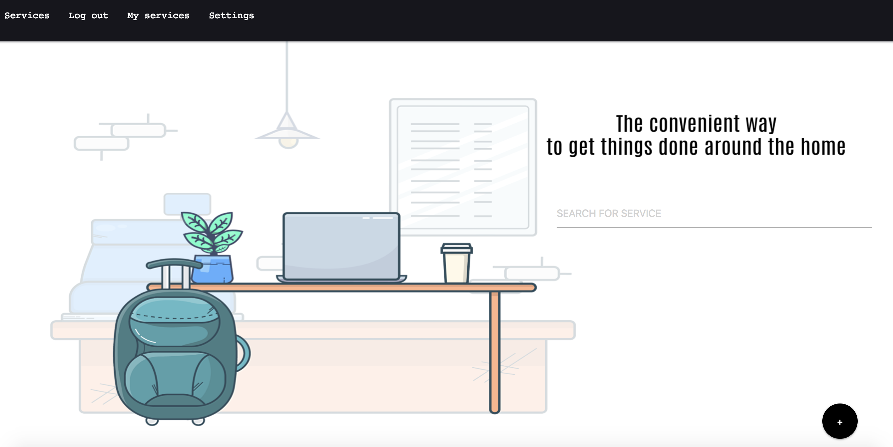
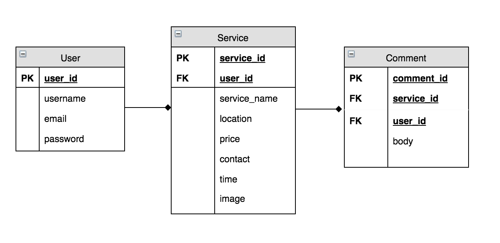

# Helper App

Available services:
1-Electrical helper
2-Plumber helper 3-Moving helper 4-Delivery helper 5-Cooking helper

HelperApp was built using Ruby on rails with three models. The app include devise and cloudinary.

## Database schema:

## App link:

[Helper App Link](https://arcane-reaches-38989.herokuapp.com/)

## Github link:

[Github link](https://github.com/Thekraalowais/HelperApp)

## Credits

Jack, Moath.

## useful links

[Illustration images](https://lukaszadam.com/illustrations/),
[materialize](https://materializecss.com/color.html)
